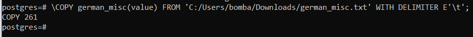
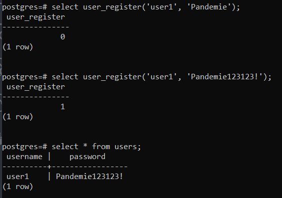

2.2.2 Створити таблицю в БД СКБД PostgreSQL, назва якої відповідає назві файлу, та
завантажити вміст файлу у таблицю, використовуючи будь-який засіб імпорту, наприклад,
команду \COPY утиліти psql.

2.2.3 Створити функцію user_register на мові програмування PL/pgSQL, яка буде
забороняти створювати пароль, якщо він є у таблиці гірших паролів.

Див. `user_register.sql`

2.2.4 Провести тестування роботи функції user_register за двома тестовими сценаріями (правильний та неправильний).

