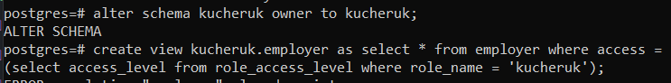

1. Створіть у БД структури даних, необхідні для роботи повноважного керування доступом.

2. Додайте до таблиці з даними стовпчик, який буде зберігати мітки конфіденційності. Визначте для кожного рядка таблиці мітки конфіденційності, які будуть різнитися (для кожного рядка своя мітка).

3. Визначте для користувача його рівень доступу.

4. Створіть нову схему даних, назва якої співпадає з назвою користувача.

5. Створіть віртуальну таблицю, назва якої співпадає з назвою реальної таблиці та яка забезпечує SELECT-правила повноважного керування доступом для користувача.

6. Створіть INSERT/UPDATE/DELETE-правила повноважного керування доступом для користувача.

7. Встановіть з’єднання з СКБД від імені нового користувача.

8. Від імені нового користувача перевірте роботу механізму повноважного керування, виконавши операції SELECT, INSERT, UPDATE, DELETE

