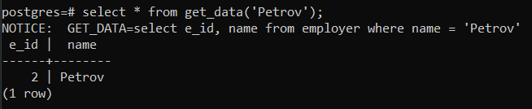
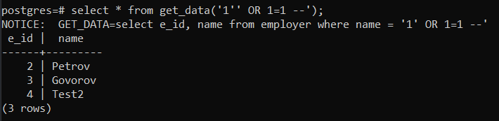
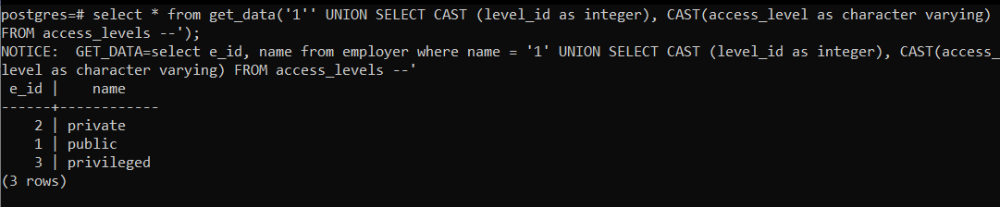
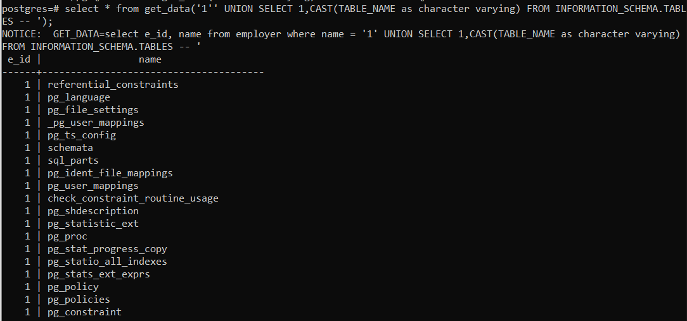

- Стандартний запит
  

- SQL-ін'єкція підкласу "Зняття фільтрації рідків умови SQL-запиту"
  

- SQL-ін'єкція підкласу "Отримання вмісту таблиць, що не входять у SQL-запит"
  

- SQL-ін'єкція підкласу "Отримання структури таблиць БД"
  
