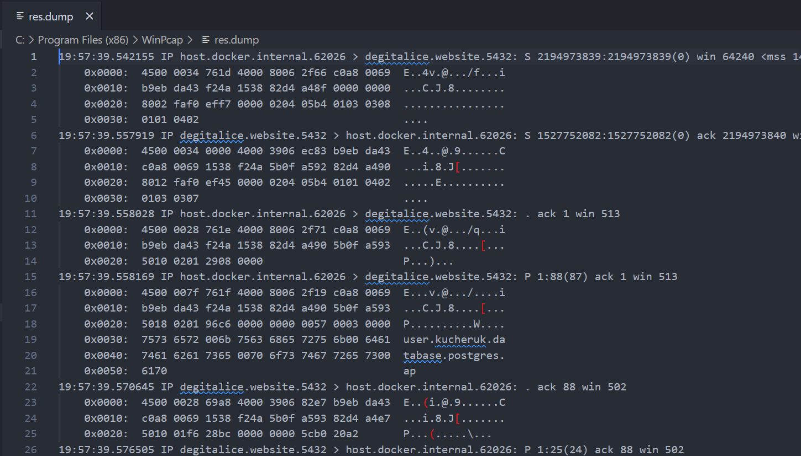

10. Проаналізувати вміст перехоплених пакетів. Підтвердити передачу деяких даних у відкритому вигляді.

Можна побачити, що user.kucheruk відправляв запит, тобто дані не знаходяться в зашифрованому вигляді
