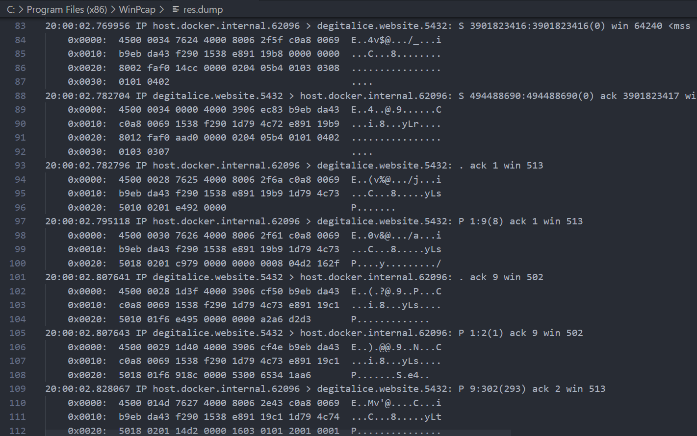

12. Проаналізувати вміст перехоплених пакетів в програмі-аналізаторі. Підтвердити відсутність даних у відкритому вигляді.

Як ми бачимо, всі дані зашифровані, більше немає можливості побачити, хто відправляє запити
