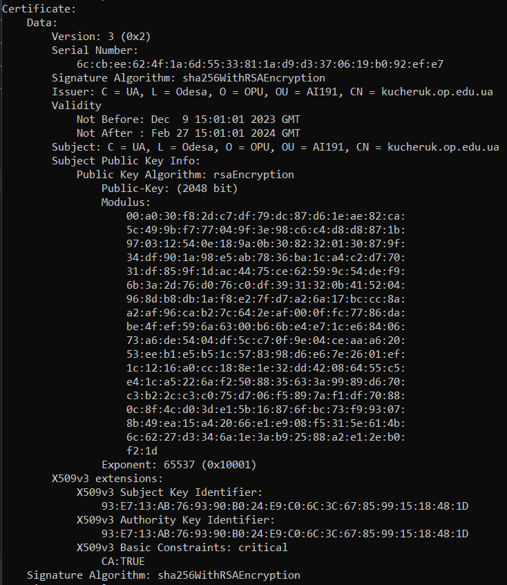

3. Переглянути вміст сертифікату та визначити алгоритми створення відкритого ключа, а також алгоритм встановлення цифрового підпису.

Відкритий ключ - алгоритм "rsaEncryption 2048 bit", алгоритм встановлення цифрового підпису - "sha256WithRSAEncryption"
