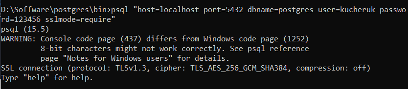

5. Використовуючи програму psql, встановити TSL/SSL-з'єднання з БД за прикладом з лабораторної роботи No8, але використовуючи формат параметрів "host=var1 port=var2 dbname=var3 user=var4 password=var5 sslmode=var6".

- Версія TSL-протоколу: TLSv1.3
- Криптоалгоритм: TLS_AES_256_GCM_SHA384
