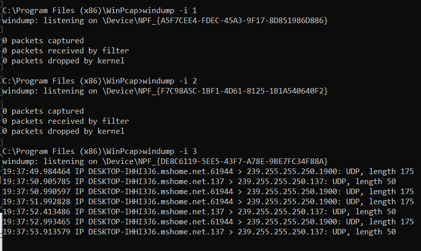

7. Провести запуск програми аналізу мережевих пакетів для кожного мережевого інтерфейсу поки не буде знайдено активний інтерфейс, який взаємодіє з мережею Internet та виводить на екран інформацію про ці пакети.

